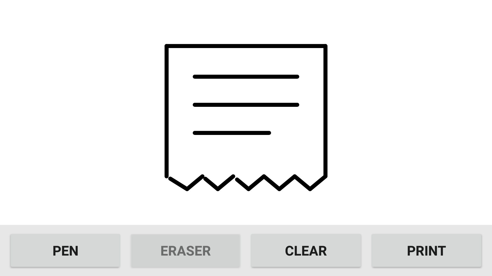

# Receipt Sketch

Wintec AnyPOS80 Android POS에서 손가락으로 그림을 그리고, 내장 80mm 영수증 프린터로 바로 출력하는 초간단 그림판 앱입니다.

<div align="center">

[](https://github.com/rudwndgus/Receipt/releases/latest/download/ReceiptSketch-v1.0.0.apk)

**Android 7.1 이상 · 인터넷 연결 없이 사용 · 설치 파일 약 840KB**

</div>

## ⬇️ APK 설치

### [ReceiptSketch-v1.0.0.apk 바로 다운로드](https://github.com/rudwndgus/Receipt/releases/latest/download/ReceiptSketch-v1.0.0.apk)

1. POS에서 위의 **APK 바로 다운로드**를 누릅니다.
2. 다운로드가 끝나면 알림창 또는 `Download` 폴더에서 APK를 엽니다.
3. 설치가 차단되면 POS의 `설정 → 보안 → 알 수 없는 출처`를 허용합니다.
4. 설치를 완료하고 앱 목록에서 **Receipt Sketch**를 실행합니다.

다른 기기에서 설치 파일만 받아 옮기려면 [최신 Release 페이지](https://github.com/rudwndgus/Receipt/releases/latest)를 이용하세요.

## 실제 실행 화면

아래 화면은 빌드된 APK를 Android 7.1(API 25), 1920×1080 환경에서 직접 실행하고 그린 뒤 캡처한 화면입니다.



## 사용 방법

앱을 열면 화면 전체가 흰색 그림판으로 표시됩니다. 하단 버튼 네 개만 사용하면 됩니다.

| 버튼 | 기능 |
| --- | --- |
| `PEN` | 검은색 펜으로 그립니다. 기본 굵기는 6dp입니다. |
| `ERASER` | 손가락이 지나간 부분을 32dp 굵기로 지웁니다. |
| `CLEAR` | 확인창에서 `CLEAR`를 누르면 그림 전체를 지웁니다. |
| `PRINT` | 현재 그림을 흑백 영수증 이미지로 변환해 바로 출력합니다. |

### 출력 순서

1. 흰 화면에 원하는 그림을 그립니다.
2. 필요하면 `ERASER`로 수정합니다.
3. `PRINT`를 누릅니다.
4. 앱이 그림 주변의 빈 공간을 제거하고 80mm 용지 폭인 576px로 맞춥니다.
5. 그림을 선명한 1-bit 흑백 ESC/POS 이미지로 변환해 출력합니다.
6. 용지를 4줄 배출하고 커팅 명령을 보냅니다.

그림이 비어 있으면 `Draw something first`, 출력이 완료되면 `Printed` 메시지가 표시됩니다. 출력 중에는 중복 인쇄를 막기 위해 `PRINT` 버튼이 잠깁니다.

## 대상 기기

| 항목 | 내용 |
| --- | --- |
| 테스트 대상 | Wintec AnyPOS80 / `WINTEC_WT32814` |
| Android | 7.1 이상, 최소 SDK 21 |
| 화면 | 가로 고정, 1920×1080 기준 |
| 프린터 | 내장 80mm 감열식 영수증 프린터 |
| 출력 폭 | 576 dots |
| 네트워크 | 앱 실행 및 출력에 필요 없음 |

## 프린터 연결 방식

확인되지 않은 Wintec SDK 함수나 서비스 이름을 추측해서 사용하지 않습니다. 앱은 실제 사용 가능한 백엔드를 다음 순서로 확인합니다.

1. 검증된 Wintec SDK 백엔드 — 현재 공개 SDK가 없어 비활성화
2. Android USB Host가 USB Printer Class(class 7)로 노출한 ESC/POS 프린터
3. 앱이 실제로 쓸 수 있는 `/dev/usb/lp0` 프린터 장치
4. ADB로 프린터 serial 장치를 확인한 경우에만 명시적으로 지정한 serial 백엔드

확인 없이 `/dev/ttyS*`에 데이터를 보내면 스캐너나 외부 COM 장치를 오작동시킬 수 있으므로 자동으로 추측하지 않습니다.

## 문제 해결

| 화면 메시지 | 확인할 내용 |
| --- | --- |
| `Draw something first` | 화면에 그림을 그린 다음 다시 출력합니다. |
| `Printer not found` | POS가 내장 프린터를 USB Printer Class 또는 프린터 장치로 노출하는지 확인합니다. |
| `USB permission denied` | 표시되는 USB 권한 요청을 허용한 뒤 다시 출력합니다. |
| `Could not open printer` | 다른 POS 앱이 프린터를 사용 중인지 확인하고 앱 또는 POS를 재시작합니다. |
| `Printer connection failed` | 용지, 프린터 전원, 커버 상태와 USB 연결을 확인합니다. |
| `Print failed: ...` | 아래 Logcat 태그에서 실제 오류 내용을 확인합니다. |

> 현재 APK 빌드와 Android 7.1 실행은 검증했습니다. 실제 AnyPOS80이 이 앱에서 지원하는 방식으로 내장 프린터를 노출하는지와 용지 출력·자동 커팅은 POS 실기기에서 최종 확인이 필요합니다.

## 개발 및 빌드

프로젝트를 Android Studio에서 열거나 다음 명령을 실행합니다.

```powershell
./gradlew.bat assembleDebug
```

생성되는 APK:

```text
app/build/outputs/apk/debug/app-debug.apk
```

주요 환경:

- Kotlin + Android XML View
- Jetpack Compose 미사용
- 최소 SDK 21
- 외부 런타임 라이브러리 없음
- 인터넷, 카메라, 위치, 저장소 권한 없음

## 진단 로그

Android Studio Logcat 또는 ADB에서 다음 태그를 사용합니다.

```text
ReceiptSketch
ReceiptSketch-Printer
ReceiptSketch-Wintec
ReceiptSketch-USB
ReceiptSketch-Serial
```

```bash
adb logcat -s ReceiptSketch ReceiptSketch-Printer ReceiptSketch-USB ReceiptSketch-Serial
```

## 소스 구조

```text
app/src/main/java/com/receiptsketch/app/
├── MainActivity.kt
├── DrawingView.kt
└── printer/
    ├── PrinterManager.kt
    ├── UsbEscPosPrinterBackend.kt
    ├── SerialEscPosPrinterBackend.kt
    ├── WintecPrinterBackend.kt
    ├── BitmapPreprocessor.kt
    └── EscPosEncoder.kt
```
